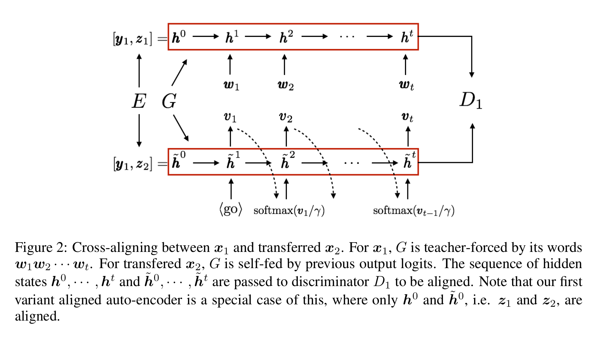

# Style Transfer from Non-Parallel Text by Cross-Alignment
---

## Idea

The authors aim to perform style transfer on language using non-parallel
corpora by separating content from style. They re-align the latent
spaces to perform three tasks: sentiment modification, decipherment of
word-substitution ciphers, and recovery of word order.

## Method

The authors' method involves learning an encoder that takes a sentence
and its original style indicator as input, and maps it to a content
representation devoid of style. This representation is then decoded by a
style-dependent decoder.

### Notation

$y \rightarrow$ latent style variable

$z \rightarrow$ latent content variable

$x \rightarrow$ data point generated from the conditional distribution

$P(x\|y,z)$

### Formulation

There are two non-parallel corpora $X_1 = \{x_1^{(1)} ... x_1^{(n)} \}$,
drawn from $p(x_1\|y_1)$ and $X_2 = \{x_2^{(1)} ... x_2^{(n)} \}$, drawn
from $p(x_2\|y_2)$

We want to estimate the style transferred distributions
$p(x_1\|x_2;y_1,y2)$ and $p(x_2\|x_1;y_1,y2)$

The authors propose a constraint that $x_1$ and $x_2$'s marginal
distributions can only be recovered if for any different styles
$y, y' \in Y$, distributions $p(x\|y)$ and $p(x\|y')$ are different, which
is a fair assumption to make because if $p(x\|y)$ = $p(x\|y')$, then the
style changes would be indiscernible.

They also prove that if the content $z$ is sampled from a centered
isotropic distribution, the styles cannot be recovered from $x$, but in
the case of $z$ being a more complex distribution like a Gaussian
mixture, then the affine transformation that converts $y, z$ into $x$
can be recovered.

The reconstruction loss is the same as the one used by an autoencoder

$$
\begin{align}
    \mathcal{L}(\theta_E,\theta_G)
        &=& \mathbb{E}_{x_1 \sim X_1}[-\log p_G(x_1\|y_1,E(x_1, y_1))] \nonumber \\
        & & + \mathbb{E}_{x_2 \sim X_2}[-\log p_G(x_2\|y_2,E(x_2, y_2))]
\end{align}
$$

### Solution 1: Aligned Autoencoder {#aligned-autoencoder}

Instead of the KL divergence loss, the authors propose aligning the
distributions $P_E(z\|x_1)$ and $P_E(z\|x_2)$ where $E$ is the encoder
function. This is done by training an adversarial discriminator to
distinguish between the two distributions.

The adversarial objective is expressed as below where $D(\cdot)$
predicts 0 if it predicts the source distribution to be $X_1$ and 1 if
it predicts the source distribution to be $X_2$ 
$$\begin{align}
    \mathcal{L}_{adv}(\theta_E,\theta_D) 
        &=& \mathbb{E}_{x_1 \sim X_1}[-\log D(E(x_1,y_1))] \nonumber \\
        & & + \mathbb{E}_{x_2 \sim X_2}[-\log(1 - D(E(x_2,y_2)))]
\end{align}$$

The overall optimization objective combining equations 1 and 2 can be written as

$$\mathcal{L} = \operatorname*{min}_{E,G} \operatorname*{max}_{D} \mathcal{L} - \lambda \mathcal{L}_{adv}$$

### Solution 2: Cross-aligned Autoencoder

This is similar to the previous solution, but instead of trying to align
$P_E(z\|x_1)$ and $P_E(z\|x_2)$ using an adversarial discriminator, two
distinct adversarial discriminators are used to align a sequence of real
and transferred generator hidden states. i.e. $D_1$ is used to align the
distributions $G(y_1, z_1)$ and $G(y_1, z_2)$. Similarly, $D_2$ is used
to align the distributions $G(y_2, z_2)$ and $G(y_2, z_1)$. These
discriminators are trained with the objective of being unable to
identify the content distributions $P(z_1)$ and $P(z_2)$

Professor-forcing is used to train both of these discriminators.
Professor forcing uses a discriminator to distinguish if the decoder
hidden states are a result of training-time teacher forcing or test time
scheduled sampling. This is a generalized version of simply using a
final encoder state, as was the case in the Aligned Autoencoder solution.

The overall optimization objective combining equation 1 and two discriminator versions of equation 2 can be written as:

$$\mathcal{L} = \operatorname*{min}_{E,G} \operatorname*{max}_{D} \mathcal{L} - \lambda (\mathcal{L}_{adv_1} + \mathcal{L}_{adv_2})$$

### Learning Process

### Experiment Setup

-   As opposed to the simple feed-forward classifier used for $D$ in the
    aligned autoencoder, $D_1$ and $D_2$ use convolutional nets for [text
    classification](https://arxiv.org/abs/1408.5882).

-   They use Yelp reviews as the data set with rating $>3$ as positive
    and rating $<3$ as negative examples. Reviews with a sentence count
    $>10$ and sentences with a word count $>10$ are filtered out. Vocab
    size used is 10K.

-   Style transfer is evaluated using a pre-trained classifier.

-   Content transfer was evaluation using human evaluations.

## Observations

-   Despite the corpora being non-parallel, the content of both corpora
    is mostly homogenous.

-   The authors cite the reason for not using VAEs for this task as the
    utility of having rich and unperturbed representations, which VAEs
    do not possess, because of the ELBO objective which forces the
    latent representation to be consistent with a prior distribution.

-   The sentiment transfer model succeeds in retaining content 41.5% of
    the time.

-   The model described in the 
    ['Toward Controlled Generation' paper](https://arxiv.org/abs/1703.00955) 
    performed better in the sentiment style transfer task. 
    The authors attribute this to the
    fact that their loss objective is directly parameterized by a
    sentiment classifier. Although the authors claim that the overall
    transfer quality is better, that metric is obtained from human
    evaluations and the difference is marginal.

-   Amongst the different models, the cross-aligned autoencoder with one
    discriminator per style performs the best on all tasks.
